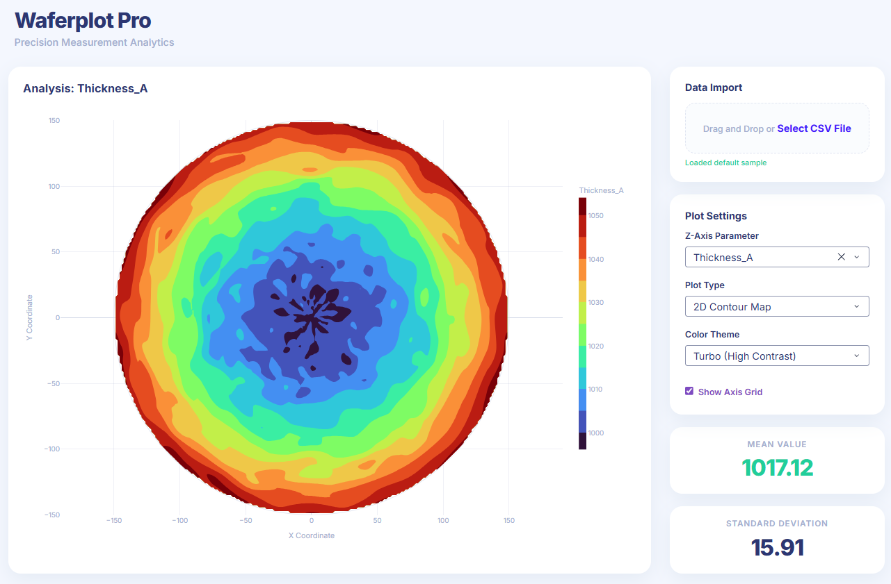

# Waferplot Pro



A modern, interactive Python Dash application for semiconductor wafer measurement analysis. Inspired by `waferplot-js`, this tool allows you to upload measurement data (like thickness, sheet resistance) and visualize it beautifully in 2D contours, 3D surface topologies, or raw scatter plots.

## Features

- **Modern SaaS UI**: A clean, light-themed premium interface with soft glass-like shadows, rounded corners, and a distraction-free Plotly viewing area.
- **CSV Data Import**: Drag-and-drop or select any CSV file containing X/Y coordinates and measurement parameters.
- **Multiple Plot Modes**:
  - **2D Contour Map**: Continuous, interpolated color map representing the wafer topology.
  - **3D Surface Topology**: A rotatable 3D model of the wafer parameter.
  - **Raw Scatter Points**: Visualize the exact positions and values of the raw measurement dies.
- **Smart Parsing**: Automatically identifies coordinate columns (`X`, `Y`, `DieX`, `DieY`) and allows you to select which parameter to plot.
- **Dynamic Color Scales**: Switch between Turbo, RdYlBu, Plasma, Viridis, and Spectral color schemes.

## Installation

1. Ensure you have Python 3.8+ installed.
2. Install the required dependencies:
   ```bash
   pip install -r requirements.txt
   ```

## Usage

1. Start the Dash server:
   ```bash
   python app.py
   ```
2. Open your browser and navigate to `http://127.0.0.1:8050`.
3. *(Optional)* If you don't have a dataset ready, run the sample generator script to create a mock dataset:
   ```bash
   python generate_sample.py
   ```
   This will generate `sample_wafer_data.csv` which will be automatically loaded into the app if no file is uploaded.

## Data Format

The application expects a CSV file. It will look for columns representing coordinates (e.g., `X`, `Y`, `DieX`, or `DieY`). All other numerical columns will be treated as measurable parameters that you can select from the dropdown.

Example:
| DieX | DieY | Thickness_A | SheetRes_Ohm |
|------|------|-------------|--------------|
| 0    | 150  | 1052.1      | 40.5         |
| 150  | 0    | 1048.9      | 41.2         |
